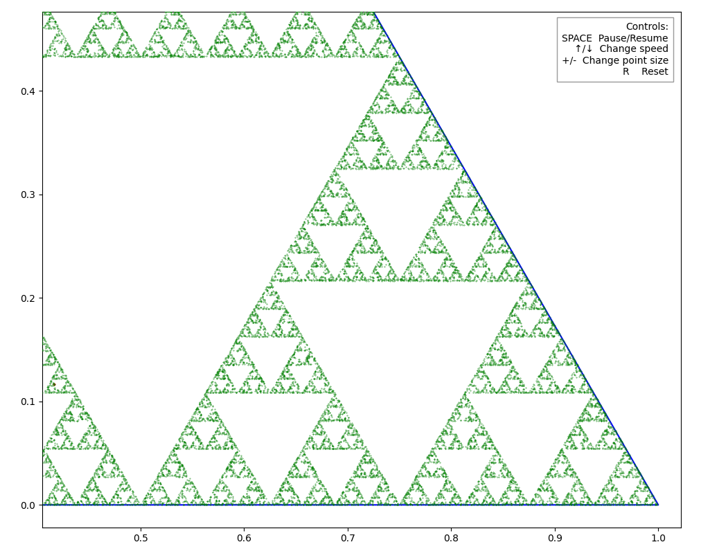
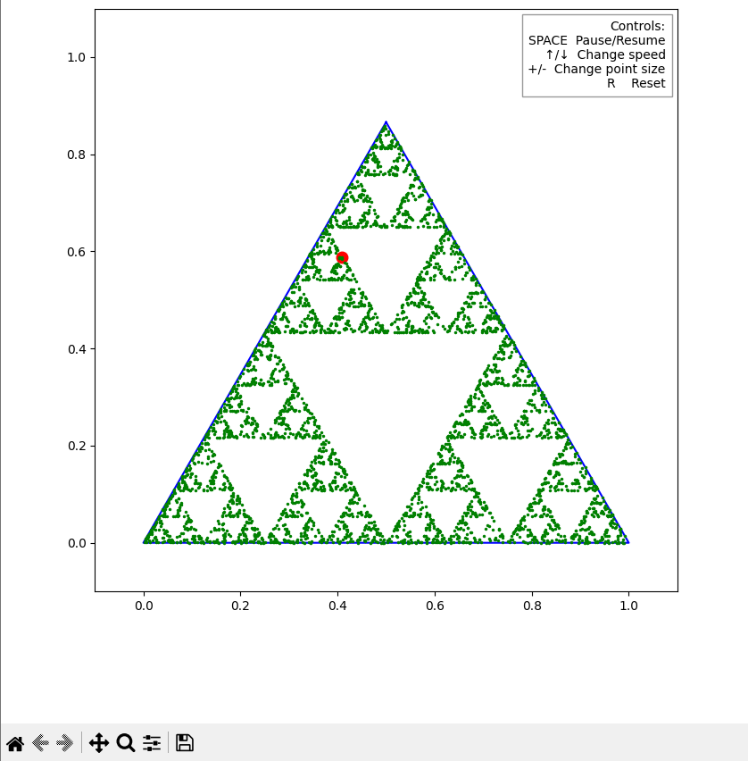
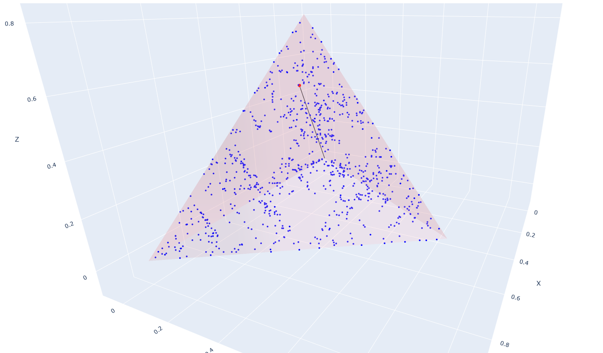

# Sierpinski Figures

A Python implementation for generating and visualizing Sierpinski triangles in 2D and 3D spaces. This project was developed as part of the Mathematical Modeling course.



## Quick Start

1. Clone the repository:
```bash
git clone https://github.com/yourusername/sierpinski-figures.git
cd sierpinski-figures
```

2. Install Poetry (if not already installed):
```bash
curl -sSL https://install.python-poetry.org | python3 -
```
Or

```bash
pip install poetry
```
3. Activate the virtual environment:
```bash
poetry shell
```

4. Install project dependencies:
```bash
poetry install
```

5. Admire the beauty of Sierpinski figures:
```bash
python '.\src\Sierpinski triangle.py'
```

```bash
python '.\src\Sierpinski pyramid.py'
```

## Overview

This project provides tools for creating and visualizing various Sierpinski fractals, including:

### Sierpinski Triangle (2D)

- Interactive visualization
- Configurable iterations
- Color mapping options

### Sierpinski Pyramid (3D)

- Full 3D rotation
- Zoom and pan controls
- Interactive vertex highlighting

## Features

- Generation of Sierpinski fractals
- 2D visualization using matplotlib
- 3D rendering with interactive rotation and zoom capabilities
- Efficient recursive implementation
- Support for saving generated figures as images

## Requirements

- Python 3.12+
- Poetry (Python package manager)

## How to Execute the Project

To execute the project and generate the Sierpinski figures, follow these steps:

1. Ensure you have installed all dependencies as described in the Installation section.
2. Activate the virtual environment:
```bash
poetry shell
```
3. Run the Python scripts to generate the figures:
```bash
python '.\src\Sierpinski triangle.py'
```
```bash
python '.\src\Sierpinski pyramid.py'
```

## Project Dependencies

Main dependencies managed by Poetry:
- numpy: Mathematical operations and array handling
- plotly: Interactive visualization of 2D and 3D figures
- pandas: Data manipulation and structuring
- matplotlib: 2D triangle visualization
- Sphinx: Documentation

## Usage

### 2D Sierpinski Triangle

```python
from sierpinski.shapes_2d import SierpinskiTriangle

# Create a triangle with 6 iterations
triangle = SierpinskiTriangle(iterations=6)
fig = triangle.plot()
fig.show()  # Opens in browser or notebook
fig.write_html("triangle.html")  # Save as interactive HTML
```

### 3D Sierpinski Pyramid

```python
from sierpinski.shapes_3d import SierpinskiPyramid

# Create a pyramid with 4 iterations
pyramid = SierpinskiPyramid(iterations=4)
fig = pyramid.plot_3d()
fig.show()  # Opens interactive 3D visualization
fig.write_html("pyramid.html")  # Save as interactive HTML
```

### Features of Visualization

- Interactive 2D or 3D rotation and zoom
- Hover information showing coordinates

- Screenshot capabilities


## Project Structure

```
sierpinski-figures/
├──  docs/            # Documentation files
    ├── index.md
    ├── sierpinski_pyramid.md    
    ├── sierpinski_triangle.md
    ├── theory.md
    └── usage.md
├── examples/
    ├── chaos_game.py
    ├── convergence_visualizer.py
    └── converage_analyzer.py
├── src/
    ├── Sierpinski pyramid.md
    ├── Sierpinski triangle orgin.py
    └── Sierpinski triangle.py
├── LICNESE.md    
├── pyproject.toml    # Poetry configuration and dependencies
├── poetry.lock      # Lock file for reproducible 
└──  README.md

    
```

## Mathematical Background

The Sierpinski figures are fractal sets that exhibit self-similarity at different scales. The project implements these mathematical concepts:

- Recursive subdivision of geometric shapes
- Iterative geometric transformations

## Contributing

This is a semester project for the Mathematical Modeling course. Feel free to use this code for educational purposes.

## License

This project is licensed under the MIT License - see the [LICENSE.md](LICENSE.md) file for details.

## Authors

[Kacper Smyrak](https://www.linkedin.com/in/kacper-smyrak-596761241/)
[Magdalena Śnietura](https://github.com/ml1006)

Mathematical Modeling Course
[Silesian University of Science](https://www.polsl.pl/)
[Faculty of Applied Mathematics](https://www.polsl.pl/rms/)

